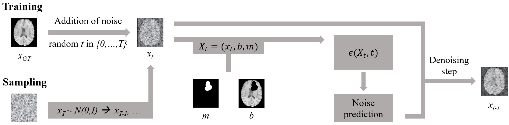

# Diffusion Models for Inpainting

Repository containing the code for all explored and extended methods used in the paper ["Denoising Diffusion Models for 3D Healthy Brain Tissue Inpainting"](https://link.springer.com/chapter/10.1007/978-3-031-72744-3_9) presented at the DGM4MICCAI workshop at MICCAI 2024 in Marrakesh, Morocco. 
If you use this repository, please star it and cite our paper in your work:
```bibtex
@inproceedings{durrer2024denoising,
  title={Denoising diffusion models for 3d healthy brain tissue inpainting},
  author={Durrer, Alicia and Wolleb, Julia and Bieder, Florentin and Friedrich, Paul and Melie-Garcia, Lester and Ocampo Pineda, Mario Alberto and Bercea, Cosmin I and Hamamci, Ibrahim Ethem and Wiestler, Benedikt and Piraud, Marie and others},
  booktitle={MICCAI Workshop on Deep Generative Models},
  pages={87--97},
  year={2024},
  organization={Springer}
}
```
## About the Paper

Monitoring diseases that affect the brain’s structural integrity requires automated analysis of magnetic resonance images, e.g., for the evaluation of volumetric changes. However, many of the evaluation tools are optimized for analyzing healthy tissue. To enable the evaluation of scans containing pathological tissue, it is therefore required to restore healthy tissue in the pathological areas. In this work, we explore and extend denoising diffusion probabilistic models (DDPMs) for consistent inpainting of healthy 3D brain tissue. We modify state-of-the-art 2D, pseudo-3D, and 3D DDPMs working in the image space, as well as 3D latent and 3D wavelet DDPMs, and train them to synthesize healthy brain tissue. Our evaluation shows that the pseudo-3D model performs best regarding the structural-similarity index, peak signal-to-noise ratio, and mean squared error. To emphasize the clinical relevance, we fine-tune this model on synthetic multiple sclerosis lesions and evaluate it on a downstream brain tissue segmentation task, where it outperforms the established FMRIB Software Library (FSL) lesion-filling method.

General overview over training and sampling procedure:



Evaluated methods:

The following list provides details of the different modified methods we evaluate:
- DDPM 2D slice-wise: A baseline method as presented in [1] with the input being defined as X<sub>t</sub> = (x<sub>t</sub>, b, m). Here, x<sub>t</sub>, b, and m are 2D slices. During training and sampling, only slices with a non-zero mask are considered. Finally, the samples are stacked to a 3D volume.
- DDPM 2D seq-pos: The above baseline method is extended by conditioning on the previous slice and positional embedding. The input is defined as X<sub>t</sub> = (x<sub>t</sub>, b, m, x<sub>prev</sub>), with x<sub>t</sub>, m, and b being 2D slices and x<sub>prev</sub> being the previous ground truth 2D slice (without noise) during training, or the previously sampled slice during sampling. In addition, we use a position embedding of the slice index. We perform slice-by-slice sampling of non-zero mask slices, where each slice is conditioned on the previous by concatenation, and the samples are stacked to a 3D volume in the end.
- DDPM Pseudo3D: A pseudo-3D method as described in [2], modified for inpainting. Pseudo-3D convolutions result from 2D convolutional layers followed by 1D convolutions in the z-axis. The input is defined as X<sub>t</sub> = (x<sub>t</sub>, b, m) with x<sub>t</sub>, b, and m being stacks of 2D slices. In contrast to [2], we apply the model in the image space and directly use the pseudo-3D convolutions without the proposed fine-tuning strategy used by [2].
- DDPM 3D mem-eff: A memory efficent 3D diffusion model as presented in [3]. The input is defined as X<sub>t</sub> = (x<sub>t</sub>, b, m). We decided to use the memory-efficent architecture by [3] for the 3D model in the image space as it allowed using two residual blocks per scale, which was not possible if we simply replaced the 2D convolutions by 3D convolutions in the baseline model.
- LDM 3D: A 3D latent diffusion model as presented in [4]. The input is defined as X<sub>t</sub> = (x<sub>lat, t</sub>, b<sub>lat</sub>, m<sub>lat</sub>), with x<sub>lat, t</sub>, b<sub>lat</sub>, and m<sub>lat</sub> being the latent representations of x<sub>GT</sub>, b, and m. These latent representations are obtained through an autoencoder (AE) following a VQ-GAN implementation. The diffusion model in the latent space is less memory-intense than in the image space. The AE required to obtain the latent representations, however, exceeds the to us available GPU memory for this experiment (40 GB) at the initial image resolution. Therefore, downsampling of the input volume x<sub>GT</sub> was required.
- WDM 3D: A 3D wavelet diffusion model as presented in [5]. The input is defined as X<sub>t</sub> = (x<sub>wav, t</sub>, b<sub>wav</sub>, m<sub>wav</sub>), with x<sub>wav, t</sub>, b<sub>wav</sub>, and m<sub>wav</sub> being the concatenated wavelet coefficients of x<sub>GT</sub>, b, and m. An inverse wavelet transform is applied to reconstruct the images from the predicted x<sub>wav, 0</sub>.

All models were trained on the publicly available dataset from the "BraTS 2023 Local Synthesis of Healthy Brain Tissue via Inpainting Challenge" [6-11]. The best performing method, DDPM Pseudo3D, was further fine-tuned and evaluated on an additional dataset originating from a multicentre MS cohort study [12, 13]. This data is not publicly available due to data privacy protection.

Inpainting generated by the different methods on a BraTS example:


## Remarks about the code

The requirements.txt file in the main folder (Diffusion_Models_Inpainting) applies to all subfolders, except LDM_3D (has an own requirements.txt file).
The preprocessing mentioned in the paper can be done using preprocessing_2D.py (to generate 2D slices) and preprocessing_3D.py (to generate 3D volumes).

## Pretrained Models

We released pretrained models on [HuggingFace](https://huggingface.co/AliciaDurrer/DM_Inpainting).
All diffusion models were trained for 325000 iterations, the autoencoder part of LDM 3D was trained for 602500 iterations. For more implementation details please have a look at the paper.

## References

[1] Durrer, A, et al.: "Denoising Diffusion Models for Inpainting of Healthy Brain Tissue." arXiv preprint arXiv:2402.17307 (2024).

[2] Zhu, L., et al.: Make-a-volume: Leveraging latent diffusion models for cross-modality 3d brain mri synthesis. In: International Conference on Medical Image Computing and Computer-Assisted Intervention. pp. 592–601. Springer (2023)

[3] Bieder, F., et al.: Memory-efficient 3d denoising diffusion models for medical image processing. In: Medical Imaging with Deep Learning (2023)

[4] Khader, F., et al.: Medical diffusion–denoising diffusion probabilistic models for 3d medical image generation. arXiv preprint arXiv:2211.03364 (2022)

[5] Friedrich, P., et al.: "WDM: 3D Wavelet Diffusion Models for High-Resolution Medical Image Synthesis." arXiv preprint arXiv:2402.19043 (2024).

[6] Baid, U., et al.: The rsna-asnr-miccai brats 2021 benchmark on brain tumor segmentation and radiogenomic classification. arXiv preprint arXiv:2107.02314 (2021)

[7] Bakas, S., et al.: Advancing the cancer genome atlas glioma mri collections with expert segmentation labels and radiomic features. Scientific data 4(1), 1–13 (2017)

[8] Bakas, S., et al.: Identifying the best machine learning algorithms for brain tumor segmentation, progression assessment, and overall survival prediction in the brats challenge. arXiv preprint arXiv:1811.02629 (2018)

[9] Karargyris, A., et al.: Federated benchmarking of medical artificial intelligence with medperf. Nature Machine Intelligence 5(7), 799–810 (2023)

[10] Kofler, F., et al.: The brain tumor segmentation (brats) challenge 2023: Local synthesis of healthy brain tissue via inpainting. arXiv preprint arXiv:2305.08992 (2023)

[11] Menze, B.H., et al.: The multimodal brain tumor image segmentation benchmark (brats). IEEE transactions on medical imaging 34(10), 1993–2024 (2014)

[12] Disanto, G., et al.: The swiss multiple sclerosis cohort-study (smsc): a prospective swiss wide investigation of key phases in disease evolution and new treatment options. PloS one 11(3), e0152347 (2016)

[13] Sinnecker, T., et al.: Brain atrophy measurement over a mri scanner change in multiple sclerosis. NeuroImage: Clinical 36, 103148 (2022)
